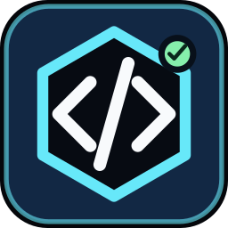

# Codex Control for Stream Deck

<p align="center">
  
</p>

Codex Control turns a Stream Deck into a local dashboard for recent Codex tasks. Project keys show the task title, workflow state, and status age. Tap a key to open the exact task; hold it to ask Codex for a fresh, read-only project status.

This is an unofficial community project and is not affiliated with or endorsed by OpenAI or Elgato.

## Features

- Meaningful Codex task titles across two lines
- Live states such as `WORKING`, `INPUT`, `APPROVAL`, `REVIEW`, `DONE`, and `FAILED`
- Freshness labels such as `UPDATED 20M` and `HOLD TO CHECK`
- Tap to open the exact `codex://threads/<id>` task
- Hold to run a schema-constrained status check without project-file writes or tool network access
- Refresh, New Task, Open Code, Review, Interrupt, Health, Settings, and Skills actions
- Optional completion updates from Codex desktop, CLI, and IDE through a loopback-only notify bridge
- Atomic local cache, bounded payloads, secret-redacted logs, and defensive approval rejection

## Install

### From a packaged release

1. Download `com.codexstreamdeck.control.streamDeckPlugin` from the repository's Releases page.
2. Double-click it and approve installation in Stream Deck.
3. Restart Stream Deck if the new actions do not appear immediately.
4. Drag **Recent Codex Project** keys into a profile, then add **Refresh** and **Health**.
5. Select any Codex Control key, open its Property Inspector, and press **Test Codex**.

### From source

Requirements: Node.js 24+, Stream Deck 7.1+, and an authenticated Codex CLI with app-server support.

```powershell
npm ci
npm run check
npm run pack
```

Open the generated `com.codexstreamdeck.control.streamDeckPlugin` file to install it.

For development:

```powershell
npx streamdeck link com.codexstreamdeck.control.sdPlugin
npm run dev
```

See [Complete setup](docs/SETUP.md) for Codex authentication, key layout, passive updates, troubleshooting, and uninstall steps.

## Recommended 15-key layout

```text
[Project 1] [Project 2] [Project 3] [Project 4] [Project 5]
[Project 6] [Project 7] [Project 8] [Refresh  ] [Health   ]
[New Task ] [Open Code] [Review   ] [Interrupt] [Settings ]
```

Project keys automatically follow physical position unless you assign a slot number or pin a task in the Property Inspector.

## What the labels mean

| Label | Meaning |
| --- | --- |
| `WORKING` / `RUNNING` | Codex or the plugin reports active work. |
| `INPUT` / `APPROVAL` | The task needs attention in Codex. |
| `REVIEW` | Work is ready to review. |
| `DONE` | A validated workflow report says the objective is complete. |
| `BLOCKED` / `FAILED` | The report identified a blocker or failure. |
| `NO STATUS` | The task has not produced a structured status report yet. |
| `HOLD TO CHECK` | Hold that project key for about one second to request a fresh status. |
| `UPDATED 20M` | The latest structured status was received 20 minutes ago. |

A quick tap opens the task. A hold of at least 650 ms starts a read-only status turn. The check can update Codex task-goal metadata, but it cannot edit project files, use tool network access, or approve an operation.

## Optional passive updates

The buttons can update after ordinary work in other Codex clients:

1. Select a Codex Control action and click **Install notify bridge** in the Property Inspector. The installer backs up `~/.codex/config.toml` and preserves a normal existing notifier by chaining it without a shell.
2. Add the contents of [AGENTS.stream-deck-status.md](com.codexstreamdeck.control.sdPlugin/instructions/AGENTS.stream-deck-status.md) to `~/.codex/AGENTS.md`.
3. Restart open Codex clients so they reload user configuration and global instructions.

The bridge listens only on a random `127.0.0.1` port, requires a 256-bit bearer token stored in the local application-data directory, and spools bounded events locally when Stream Deck is unavailable.

## Security and privacy

- No API key is required by the plugin; it uses the local authenticated Codex CLI.
- No personal names, local user paths, credentials, or task history are committed to this repository.
- The plugin stores recent task metadata and status summaries locally. It does not provide its own cloud service.
- Pressing a status or task action can send the associated prompt/context through the user's normal Codex session.
- Status turns are read-only with tool network access disabled and approval policy `never`.
- The notify server is loopback-only, token-authenticated, size-bounded, and rejects unknown event types.
- All process launches use argument arrays with `shell: false`.

Read [Security policy](SECURITY.md) and the [security audit](docs/SECURITY-AUDIT.md) for the threat model, findings, residual risks, and reporting process.

## Development

```powershell
npm run typecheck
npm test
npm run test:integration
npm run build
npm run validate
npm run security
```

The integration test starts a real local `codex app-server`, completes the JSON-RPC initialization handshake, and lists threads without starting a model turn.

See [Architecture](docs/ARCHITECTURE.md), [Development and release](docs/DEVELOPMENT.md), the [protocol notes](docs/PROTOCOL-NOTES.md), and the original [v1.1 specification](spec/stream-deck-codex-integration-spec-v1.1.md).

## Official references

- [Codex App Server](https://learn.chatgpt.com/docs/app-server)
- [Codex authentication](https://learn.chatgpt.com/docs/authentication)
- [Codex `AGENTS.md` instructions](https://learn.chatgpt.com/docs/agent-configuration/agents-md)
- [Stream Deck SDK getting started](https://docs.elgato.com/streamdeck/sdk/v1/introduction/getting-started/)
- [Stream Deck plugin packaging](https://docs.elgato.com/streamdeck/cli/commands/pack/)

## License

[MIT](LICENSE)
