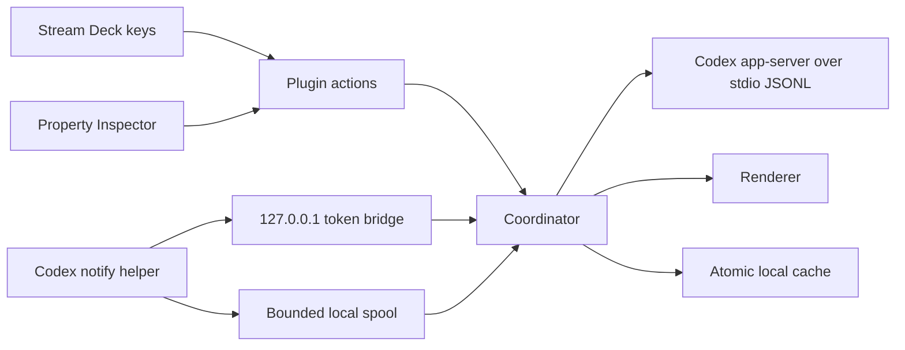
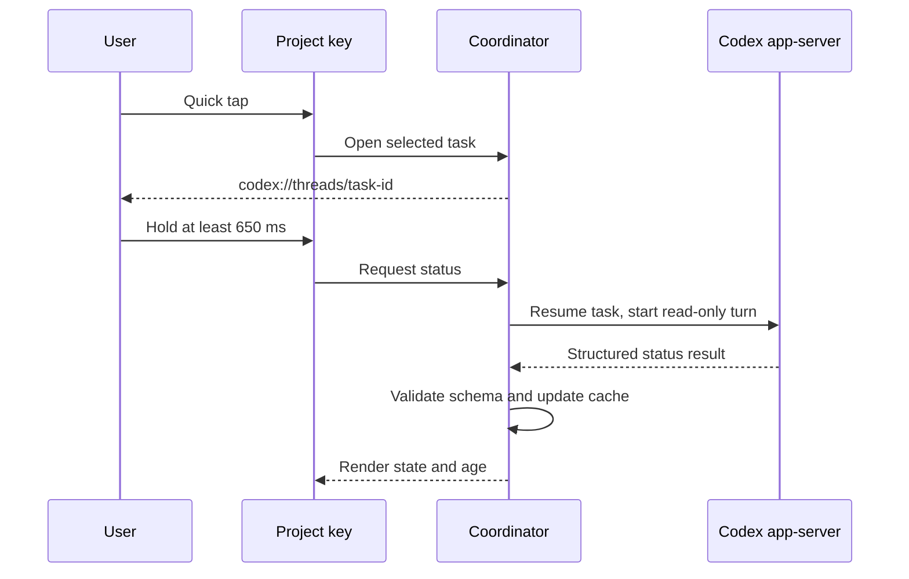

# Architecture

## Components

The plugin process is the only long-running component. It starts one Codex app-server child process over the default stdio transport, initializes the JSON-RPC connection, polls task metadata, and reacts to app-server notifications.

## Data model

Codex tasks are grouped by canonical project identity:

1. Resolve the task working directory.
2. If it belongs to Git, use the repository top level.
3. When worktree grouping is enabled, use the Git common directory as the identity anchor.
4. Hash the normalized identity anchor for the local project ID.
5. Choose a primary task by pin, approval need, plugin-owned activity, workflow attention, then recency.

The visible name is the primary Codex task title, falling back to a bounded preview and finally the project directory name.

## State separation

Runtime state and workflow state are deliberately separate:

- Runtime: not loaded, idle, active, system error, or unknown
- Workflow: working, needs input, blocked, ready for review, done, paused, failed, or unknown
- Freshness: fresh, aging, or stale

An idle runtime never implies completed work. `DONE` requires a schema-valid workflow report.

## Project-key interaction

## App-server boundary

- Transport: child-process stdio with newline-delimited JSON
- Initialization: `initialize`, then `initialized`
- Maximum incomplete JSONL frame: 5 MiB
- Request timeouts and pending-request cleanup
- Runtime validation of message envelopes and IDs
- Automatic rejection of approvals, permissions, elicitation, and user-input requests
- Unknown server-initiated requests receive a JSON-RPC error

Status turns use read-only sandbox policy, no tool network access, and approval policy `never`. New plugin-owned tasks use a workspace-write sandbox limited to the selected project root and no tool network access.

## Notify boundary

Passive notifications are optional.

- Python helper receives the Codex notifier JSON argument.
- It minimizes and byte-bounds the payload.
- It reads a short-lived endpoint file from the local app-data directory.
- It POSTs JSON to a random loopback port with a 256-bit bearer token.
- The server checks loopback origin, exact path/method, content type, token, event version/type, IDs, absolute working directory, and size.
- If the server is unavailable, the helper writes an atomic, user-local spool file.
- The plugin rejects symlink spool entries and processes at most 500 per drain.

## Persistence

The cache uses a schema version, a 10 MiB limit, an exclusive temporary file, `fsync`, atomic rename, and a last-known-good copy. Logs rotate at 1 MiB and redact common API-key, bearer-token, and query-secret patterns.

## Rendering

Key images are generated as SVG and sent as encoded data URLs. Every user- or task-derived string is stripped of XML control characters and XML-escaped. Colors, geometry, and status icons come only from internal constants.

## Deep links and process launches

Codex URLs are parsed and allow-listed by protocol, host, route, and task-ID grammar. Editor and OS launches use `spawn` or `execFile` with argument arrays and `shell: false`. User-configured executable paths are trusted local configuration and are never accepted from task output.
