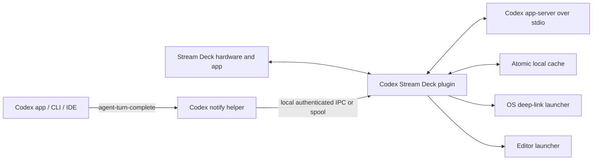

# Stream Deck Control Surface for Codex

**Product and technical specification**

**Version:** 1.0

**Date:** 2026-07-15

**Target platforms:** macOS and Windows

**Target software:** Stream Deck 7.1+, Node.js 24+, local Codex app/CLI/IDE sessions

## 1. Executive decision

Build a native Stream Deck plugin in TypeScript. The plugin should use a locally spawned `codex app-server --listen stdio://` process for thread discovery, thread history, status events for threads it owns or loads, and actions such as starting, resuming, interrupting, and reviewing a turn.

Add a small user-level Codex `notify` bridge so turns completed in other Codex clients (Codex app, CLI, or IDE extension) can update the Stream Deck cache. Use `AGENTS.md` to make every normal Codex completion include a compact machine-readable workflow status. Use a schema-constrained, read-only Codex turn only when the user explicitly requests a fresh status.

The most important design rule is:

> Do not equate Codex runtime state with project workflow state.

A persisted thread can be `notLoaded` in the plugin's app-server process while work is complete, blocked, or active in another Codex client. The plugin therefore keeps separate runtime, workflow, verification, freshness, and connection states.

## 2. User outcome

The Stream Deck should become a compact operations console for current coding work:

- The first N project keys show the most relevant recent projects.
- Each project key shows a project name, a plain-language status label, and freshness.
- A tap opens the exact Codex thread for that project.
- A hold asks Codex for a safe, read-only status update.
- Dedicated keys can create a task, open the project in an editor, start a review, interrupt a plugin-owned turn, refresh all project data, and open Codex settings or skills.
- The buttons must never imply that work is finished merely because a thread is idle or unloaded.

## 3. Assumptions and defaults

- "Code" means Visual Studio Code or a compatible editor whose launcher can be configured. The default launcher is `code`.
- A Stream Deck profile has at least five keys. The design scales to Stream Deck XL and Stream Deck Plus.
- The primary implementation is local. Remote Codex environments and Codex cloud tasks are out of scope for the first release.
- Existing Codex authentication is reused. The plugin does not store an OpenAI API key.
- The plugin supports Codex versions through capability detection and a tested version range rather than assuming every installed Codex build has identical app-server fields.

## 4. Research findings that drive the design

### 4.1 Codex integration surface

Codex app-server is explicitly intended for rich clients and provides authentication, conversation history, approvals, and streamed agent events. It uses JSON-RPC 2.0 semantics and supports a newline-delimited JSON stdio transport. The stable API includes thread start, resume, read, and list operations, turn start and interrupt, reviews, thread goals, and event notifications.

Use the stdio transport in the first release. The official documentation labels WebSocket transport experimental and unsupported, so it should not be a production dependency for the plugin.

`thread/list` can page through stored threads and sort by creation, update, or recency. Thread records include a working directory and runtime status. `thread/status/changed` is emitted for loaded threads, including an active flag such as `waitingOnApproval`. A thread can also be `notLoaded`, `idle`, or `systemError`.

The key limitation is scope: runtime events are tied to threads loaded in the app-server process to which the plugin is connected. Therefore, a separately spawned plugin app-server cannot be assumed to observe every live action performed through another Codex process. The optional `notify` bridge addresses completion and approval-request events across clients; it does not make all external in-flight states authoritative.

Two protocol facts materially shape the design and must be validated in Phase 0:

1. **Approval requests are routed to the owning client connection.** When a turn needs approval, the app-server sends a server-initiated JSON-RPC request to the client that started the turn, and that client must respond with a decision. An approval raised on a plugin-owned turn is therefore *not* answerable from the Codex desktop app, even if the same thread is opened there. Section 11.9 defines the required routing policy.
2. **Recent Codex builds expose a shared app-server control plane.** Current documentation describes a Unix control socket at `$CODEX_HOME/app-server-control` (bridged by `codex app-server proxy`) and states that multiple clients can subscribe to the same thread simultaneously. If the Phase 0 spike confirms that a plugin client can attach to this shared surface and subscribe to threads owned by the desktop app, CLI, or IDE extension, authoritative external live state becomes available without the notify bridge. This capability must be feature-detected per installed Codex version and must not be a hard dependency.

### 4.2 Codex deep links

Codex supports these useful deep links:

- `codex://threads/<thread-id>` opens an exact local task.
- `codex://threads/new` opens a new local task.
- `codex://new?prompt=<encoded>&path=<absolute-path>` opens a new local task with a prefilled prompt and workspace. It does not submit the prompt automatically.
- `codex://settings`, `codex://skills`, and `codex://automations` open those app surfaces.

The Stream Deck SDK's URL helper does not support custom URL schemes. The plugin therefore launches `codex://` links through an operating-system process, with strict validation and no shell interpolation.

### 4.3 AGENTS.md

Codex reads `AGENTS.md` before work and layers global guidance from the Codex home directory with project-specific guidance from the project root down to the current working directory. This is the correct place for the status-reporting contract and project-specific build/test instructions.

`AGENTS.md` is not a runtime database. The plugin owns runtime state, timestamps, project IDs, thread IDs, and cached reports.

### 4.4 Stream Deck SDK

The current Stream Deck SDK development baseline is Node.js 24+ and Stream Deck 7.1+. A plugin can update key titles and images dynamically. SVG is the recommended image format. Animated image formats such as GIF are not supported.

Stream Deck supports no more than two fully supported manifest states. Since this product needs many statuses, each project action should use one manifest state and render a dynamic SVG instead of mapping workflow states to manifest states.

## 5. Scope

### 5.1 MVP

The MVP must provide:

1. Recent Project Slot action, in automatic or pinned mode.
2. Dynamic project status rendering.
3. Tap to open the exact Codex thread.
4. Hold to request a fresh read-only status.
5. Refresh All action.
6. New Task action.
7. Open in Editor action.
8. Review Changes action.
9. Interrupt Active Turn action for turns controlled by this plugin.
10. Health/Connection action.
11. Property Inspector for global and per-action settings.
12. Optional Codex completion bridge using the user-level `notify` setting.
13. A reusable `AGENTS.md` section and JSON status schema.

### 5.2 Explicitly excluded from MVP

- One-tap approval of shell commands, file changes, or permission elevation.
- Arbitrary shell commands entered in the Stream Deck UI.
- `thread/shellCommand`, because it runs outside the Codex sandbox with full access.
- Experimental app-server methods unless separately feature-flagged.
- WebSocket app-server transport.
- Dependence on Stream Deck profile switching.
- Cloud task management, remote SSH environments, or multi-machine synchronization.
- Guaranteed live status for turns started in an unrelated Codex process. External completion is supported; external in-flight state remains best effort.

## 6. Product terminology

### Project

A local codebase represented by one Stream Deck project key. A project can have multiple Codex threads.

### Thread

A Codex conversation/task. The plugin selects one primary thread for each project but retains metadata for other candidate threads.

### Runtime status

What the connected app-server process knows about a loaded thread: `notLoaded`, `idle`, `active`, or `systemError`, plus active flags.

### Workflow status

The model-reported state of the requested engineering objective: working, needs input, blocked, ready for review, done, paused, failed, or unknown.

### Verification status

Whether relevant tests/checks have not run, are running, passed, failed, or cannot be determined.

### Freshness

How recently the plugin received trustworthy data for the project.

## 7. High-level architecture



### 7.1 Plugin process

The Stream Deck plugin process is the coordinator. It owns:

- Stream Deck action lifecycle.
- App-server child process lifecycle.
- Thread polling and event subscription.
- Project grouping and ranking.
- Button rendering.
- Tap/hold gesture handling.
- Status parsing and validation.
- Notify bridge endpoint and spool drain.
- Local cache and settings.
- Native Codex/editor launching.

### 7.2 Codex adapter

The Codex adapter:

- Spawns `codex app-server --listen stdio://`.
- Sends `initialize` without experimental capabilities for the MVP.
- Sends JSON-RPC requests as one JSON object per line.
- Continuously parses response and notification lines.
- Correlates requests by ID.
- Restarts the process with capped exponential backoff.
- Exposes typed operations to the rest of the plugin.

### 7.3 Completion bridge

The notify helper is a tiny executable or Python script configured in user-level `~/.codex/config.toml`. Codex passes it an `agent-turn-complete` payload containing fields such as the thread ID, turn ID, working directory, input messages, and final assistant message.

The helper must:

1. Parse the JSON payload defensively.
2. Send a minimized event to the plugin through a local-only endpoint protected by a random token.
3. Exit quickly.
4. If the plugin is unavailable, atomically write the event to a spool directory under the user's Codex home.
5. Never execute content from the payload.

The plugin drains the spool on startup and after reconnect.

### 7.4 Cache

Use an atomic versioned JSON cache for the MVP. The expected record count is small and does not justify a native database dependency.

Suggested location:

- macOS: the plugin's application support directory.
- Windows: the plugin's local application data directory.

Write to a temporary file, fsync where practical, then rename. Keep the last known good copy after a parse or write failure.

## 8. Project identity and grouping

### 8.1 Canonical project ID

For each thread working directory:

1. Resolve the real path.
2. If it is inside a Git repository, resolve the repository top-level directory.
3. If `groupWorktrees` is enabled, resolve the common Git directory and use it as the grouping anchor while preserving each worktree path as a workspace candidate.
4. Otherwise use the canonical repository top-level path.
5. For a non-Git directory, use the canonical working-directory path.
6. Hash the canonical identity to produce a stable `projectId`.

Do not group projects only by Git remote URL. Separate local clones of the same remote can have intentionally different environments and state.

### 8.2 Thread query

Initial/default query:

```json
{
  "limit": 100,
  "sortKey": "recency_at",
  "sortDirection": "desc",
  "sourceKinds": ["cli", "vscode", "appServer"],
  "archived": false
}
```

The implementation should capability-detect accepted source kinds and tolerate older servers that do not recognize newer filters.

Exclude by default:

- ephemeral threads;
- `exec` threads;
- subagent and review-subagent threads;
- archived threads;
- records without a usable working directory.

### 8.3 Underway eligibility

A project is eligible for an automatic slot when at least one is true:

- The plugin has authoritative active or approval state for its primary thread.
- The cached workflow state is `working`, `needs_input`, `blocked`, `ready_for_review`, `paused`, or `failed`.
- The project has activity within `recentHorizonDays`, default 14.
- The slot is pinned.

A project with workflow state `done` remains visible for `doneGraceHours`, default 24, then drops out of automatic slots unless pinned.

### 8.4 Primary thread selection

Choose the primary thread for a project in this order:

1. A valid explicitly pinned thread.
2. A thread with plugin-authoritative `waitingOnApproval`.
3. A thread with a plugin-owned active turn.
4. A thread whose last workflow report is `needs_input`, `blocked`, `failed`, or `ready_for_review`.
5. The incomplete thread with the greatest recency timestamp.
6. The most recent remaining thread.

The key should show a small numeric attention count when more than one thread in the same project requires attention.

### 8.5 Project ordering

Automatic project slots sort by:

1. Pinned slot assignment.
2. Connection/authentication failure that requires user action.
3. Approval required.
4. Failed or system error.
5. Needs input.
6. Blocked.
7. Active work.
8. Ready for review.
9. Paused.
10. Recency.

## 9. State model

Store state in independent layers.

### 9.1 Connection state

```text
connected
starting
offline
auth_required
incompatible
degraded
```

### 9.2 Runtime state

```text
not_loaded
idle
active
system_error
unknown
```

Additional active flags are stored as strings. Known flags should be mapped to display behavior. Unknown flags must not crash the plugin; show `ACTIVE?` and log the field.

`not_loaded` means only that the thread is not loaded in the plugin's app-server process. It must never be mapped to `done`.

### 9.3 Workflow state

```text
working
needs_input
blocked
ready_for_review
done
paused
failed
unknown
```

### 9.4 Verification state

```text
not_run
running
passed
failed
unknown
```

### 9.5 Freshness state

Default thresholds:

- `fresh`: report observed in the last 15 minutes.
- `aging`: 15 minutes to 2 hours.
- `stale`: older than 2 hours.

The thresholds are configurable. Runtime events from the plugin-owned app-server refresh runtime freshness. A notify completion refreshes workflow freshness only if a valid status marker is present; otherwise it refreshes activity but leaves workflow state unknown.

### 9.6 Display precedence

Display the first matching state:

1. `SETUP`, `AUTH`, `OFFLINE`, or `INCOMPAT`.
2. `ERROR` or `FAILED`.
3. `APPROVAL` for an authoritative approval wait.
4. `RUNNING` for a plugin-owned active turn.
5. `INPUT`.
6. `BLOCKED`.
7. `REVIEW`.
8. `DONE`.
9. `PAUSED`.
10. `IDLE` or `STATUS?`.

A stale indicator is added without replacing a higher-priority label.

## 10. Key rendering specification

### 10.1 Rendering strategy

- Use one manifest state.
- Render a dynamic SVG data URL through `setImage`.
- Use text plus iconography; do not rely on color alone.
- Keep the Stream Deck title blank by default so the SVG controls layout consistently.
- Respect a user-specified custom image: when the SDK prevents runtime image replacement, update the title with the abbreviated status instead.

### 10.2 Project key layout

For a standard square key:

```text
[status glyph] [attention count]
Project name line 1
Project name line 2
STATUS     12m
```

Rules:

- Project display name: maximum two lines, approximately 12 characters per line depending on device DPI.
- Status: uppercase, maximum 10 characters.
- Freshness: `now`, `4m`, `2h`, `3d`, or `stale`.
- Use a small border or corner mark for pinned projects.
- Use a visible exclamation mark for attention states.
- A subtle pulse may be simulated by replacing the SVG every 1-2 seconds for plugin-owned active work, but must be disabled by default to reduce unnecessary updates.

### 10.3 Suggested glyphs

```text
RUNNING             play/gear
APPROVAL            shield + !
INPUT                question mark
BLOCKED              stop/barrier
REVIEW               eye/checklist
DONE                 check
FAILED/ERROR         x/triangle
PAUSED                pause
STATUS?/STALE         clock/question
OFFLINE/AUTH          broken link/key
```

## 11. Interaction model

### 11.1 Recent Project Slot

**Tap:** Open `codex://threads/<primary-thread-id>`.

**Hold (default 650 ms):** Request a fresh status report.

**Optional tap mode:** Open editor, open both Codex and editor, or refresh status. This is configured in the Property Inspector.

**While active:** A hold queues a status request to run after the current plugin-owned turn completes. It must not silently steer an in-flight turn unless the user explicitly chooses a `steer` hold action.

**Missing thread:** Re-resolve the project and select a replacement thread. If none exists, open a new local task for the project.

### 11.2 Fresh status request

When the primary thread is idle or not loaded:

1. Call `thread/resume`.
2. Start a turn with the `STREAM_DECK_STATUS_REQUEST_V1` prompt.
3. Set `approvalPolicy` to `never`.
4. Set a read-only sandbox policy.
5. Attach the JSON status output schema.
6. Parse the completed structured output.
7. Update the cache and key.
8. Optionally open the exact thread after completion, controlled by a setting.

The status turn must not edit files, install dependencies, start services, commit, push, or request elevation.

### 11.3 Refresh All

- Re-run `thread/list` immediately.
- Recompute projects and slot assignment.
- Drain notify spool.
- Do not start model turns for every project by default.
- An optional `refresh stale reports` mode may queue explicit status turns for stale projects, with concurrency 1 and a configurable daily limit.

### 11.4 New Task

Modes:

- New task in the project assigned to another selected slot.
- New task in a pinned project.
- New task using a configured prompt template.

Preferred implementation for automatic submission:

1. `thread/start` with the project working directory.
2. `turn/start` with the configured prompt, `approvalPolicy: "never"`, and the configured plugin-owned sandbox policy (default `workspaceWrite` scoped to the project root, network access off).
3. Open `codex://threads/<new-thread-id>`.

Plugin-owned turns must never be started with an approval policy that can generate an approval request, because the request would be routed to the plugin connection, which deliberately has no approval UI (see 11.9). Under `approvalPolicy: "never"`, work that would have required elevation fails inside the sandbox instead of asking; the turn's final state and the status marker report this honestly, and the user continues the thread in the Codex app with full approval UI. This is the intended handoff, not an error in the plugin.

Fallback implementation:

- Open `codex://new?path=<absolute-path>&prompt=<encoded>`; this prefills but does not submit. Use this mode when the user has configured `newTaskMode: "handoff"`, which delegates the entire turn (including approvals) to the Codex app.

### 11.5 Open in Editor

Use a configurable command, default:

```text
code --reuse-window <project-root>
```

Launch with an argument array, never a concatenated shell string.

### 11.6 Review Changes

Use `review/start` with `target.type = "uncommittedChanges"` and inline delivery by default. The key shows `REVIEWING` while the plugin-owned review turn is active. When complete, open the exact thread.

### 11.7 Interrupt Active Turn

Only enable when the plugin knows both the active thread ID and active turn ID. Use `turn/interrupt`. Require a hold or a second confirmation gesture. Do not attempt to interrupt an external turn whose ID is unknown.

### 11.8 Approval handling

Approval states come from two distinct sources with different capabilities:

- **External approvals.** An approval raised on a turn owned by the Codex app, CLI, or IDE extension. The plugin learns about these through the notify `approval-requested` event (16.6) or, when available, shared control-plane subscription. The plugin can display `APPROVAL` but cannot answer it. Pressing the key opens the exact Codex thread, where the owning client presents the approval UI. This is correct and complete behavior for external approvals.
- **Plugin-owned approvals.** These must not occur by policy (11.9). If one arrives anyway, the plugin auto-declines it and enters the handoff state.

Do not approve from Stream Deck in the MVP. A later opt-in action may support approval only with a deliberate hold and a visible second-stage confirmation, and only for approval requests routed to the plugin's own connection. It must display the requested command or permission in the Property Inspector or Codex UI before a response is sent.

### 11.9 Approval routing policy for plugin-owned turns

The app-server delivers approval requests as server-initiated JSON-RPC requests to the client connection that started the turn. That client must respond; an unanswered request stalls the turn indefinitely. Opening the thread in the Codex app does not transfer the pending request. The plugin therefore enforces:

1. **Prevention.** Every plugin-started turn (status, new task, named action, review) sets `approvalPolicy: "never"` and an explicit sandbox policy. Explicit status turns use `readOnly`. Other plugin-owned turns default to `workspaceWrite` scoped to the project root with network access off, configurable per action but never elevated to `dangerFullAccess` from the Stream Deck.
2. **Decline-by-default responder.** As defense in depth, the adapter registers a handler for all server-initiated approval request methods (for example `item/commandExecution/requestApproval` and file-change approvals). Any request that arrives on the plugin connection is answered with `decline` immediately and logged. The plugin must never leave a server-initiated request unanswered.
3. **Handoff state.** After an auto-decline or a sandbox-denied failure, the key shows `IN CODEX` with attention `normal`, and press opens the exact thread so the user can re-run the work in a client with approval UI. The status marker or turn error text is used for the cached summary.
4. **No self-approval.** The plugin never responds `accept` to any approval request in the MVP, regardless of settings, project configuration, or prompt content.

Capability note: if the installed Codex version supports an approvals-reviewer or named permission profiles, the plugin still applies rules 1-4; those features are not a substitute for connection-level routing safety.

## 12. Action catalog

| Action | MVP | Default press behavior | Safety level |
|---|---:|---|---|
| Recent Project Slot | Yes | Open exact thread | Low |
| Refresh All | Yes | Refresh metadata/cache | Low |
| New Task | Yes | Start task and open it | Medium |
| Open in Editor | Yes | Open project root | Low |
| Review Changes | Yes | Start Codex review | Medium |
| Interrupt Active Turn | Yes | Hold to interrupt | Medium |
| Codex Settings | Yes | Open settings deep link | Low |
| Codex Skills | Yes | Open skills deep link | Low |
| Health | Yes | Show/retry connection | Low |
| Run Named Project Action | Phase 2 | Start allowlisted Codex prompt | Medium |
| Steer Turn | Phase 2 | Send canned steering input | Medium |
| Respond to Approval | Phase 2 | Two-stage confirmation | High |
| Raw Shell Command | No | Not provided | Unacceptable by default |

## 13. Codex app-server protocol requirements

### 13.1 Initialization

- Identify the client with a stable name, title, and plugin version.
- Do not opt into experimental APIs in the MVP.
- Ignore unknown notifications.
- Log protocol errors without logging full prompts or assistant output by default.

### 13.2 Required stable operations

The adapter must wrap:

```text
thread/list
thread/read
thread/start
thread/resume
thread/goal/get
thread/goal/set
turn/start
turn/interrupt
review/start
```

It must handle:

```text
thread/status/changed
thread/started
thread/closed
thread/archived
thread/unarchived
turn/started
turn/completed
warning
configWarning
```

### 13.3 Polling

Default metadata poll interval: 10 seconds while at least one project action is visible, 60 seconds otherwise.

Polling must be suspended or reduced during repeated failures and restored after `onSystemDidWakeUp`.

Use event notifications for prompt updates to plugin-owned/loaded threads. Polling is a reconciliation mechanism, not a substitute for event handling.

### 13.4 Status turn request

Representative request:

```json
{
  "method": "turn/start",
  "id": 301,
  "params": {
    "threadId": "thr_example",
    "input": [
      {
        "type": "text",
        "text": "STREAM_DECK_STATUS_REQUEST_V1\nReturn only a status object matching the supplied schema. Do not modify files, install dependencies, start services, commit, push, or request permissions. Use the current thread and quick read-only repository evidence. Do not claim a check passed unless it ran in this turn or the current thread contains unambiguous recent evidence; otherwise use not_run or unknown."
      }
    ],
    "cwd": "/absolute/project/root",
    "approvalPolicy": "never",
    "sandboxPolicy": {
      "type": "readOnly",
      "access": { "type": "fullAccess" }
    },
    "outputSchema": { "$ref": "stream-deck-status.schema.json" }
  }
}
```

At runtime the `$ref` must be replaced with the full schema object unless the installed app-server explicitly supports external schema references.

### 13.5 Goal mapping

When thread goal APIs are available, store the actual objective as the goal objective and map the coarse workflow state:

```text
working                 -> active
needs_input             -> blocked
blocked                 -> blocked
failed                  -> blocked
ready_for_review        -> paused
paused                  -> paused
done                    -> complete
unknown                 -> do not overwrite
```

The full status report remains in the plugin cache. Goal state is only a coarse interoperable signal.

## 14. Status report contract

### 14.1 Model-produced object

```json
{
  "version": 1,
  "workflowStatus": "ready_for_review",
  "objective": "Add Stream Deck project status controls",
  "headline": "MVP integration spec ready",
  "summary": "Architecture, status semantics, and safe action flows are specified; implementation has not started.",
  "completed": [
    "Defined app-server and notify bridge architecture",
    "Defined project grouping and key behavior"
  ],
  "next": [
    "Scaffold the TypeScript Stream Deck plugin",
    "Implement the app-server JSONL client"
  ],
  "blockers": [],
  "attention": "normal",
  "tests": {
    "state": "not_run",
    "summary": "Specification only; no executable implementation exists."
  }
}
```

### 14.2 Plugin envelope

The plugin adds trusted metadata outside the model-produced object:

```json
{
  "schemaVersion": 1,
  "projectId": "sha256:...",
  "projectRoot": "/canonical/project/root",
  "threadId": "thr_...",
  "turnId": "turn_...",
  "source": "explicit_status_turn",
  "observedAt": "2026-07-15T15:30:00Z",
  "runtimeStatus": {
    "type": "idle",
    "activeFlags": []
  },
  "freshness": "fresh",
  "report": {}
}
```

Never accept `projectId`, `projectRoot`, `threadId`, `turnId`, timestamps, or runtime state from model output.

### 14.3 Passive completion marker

Normal Codex final messages should append this hidden marker:

```html
<!-- codex-stream-deck-status
{"version":1,"workflowStatus":"ready_for_review","objective":"Add OAuth callback handling","headline":"OAuth fix ready","summary":"Callback validation and error handling are implemented.","completed":["Implemented state validation"],"next":["Review the diff"],"blockers":[],"attention":"normal","tests":{"state":"passed","summary":"Targeted authentication tests passed."}}
-->
```

Requirements:

- The JSON must be on one line.
- No Markdown fence inside the comment.
- No secrets, tokens, raw logs, full source code, or unnecessary absolute paths.
- The visible final answer should still be useful to a human.
- If the marker is missing or invalid, the plugin keeps the last valid workflow report and marks freshness accordingly.

## 15. AGENTS.md specification

Install the generic contract in the user-level Codex guidance file and put project-specific commands in each repository's `AGENTS.md`.

Recommended layering:

```text
~/.codex/AGENTS.md                 generic Stream Deck reporting contract
<repo>/AGENTS.md                   project commands, definition of done, constraints
<repo>/<subdir>/AGENTS.md          optional local overrides
```

Do not put transient project status into `AGENTS.md`.

The supplied `AGENTS.stream-deck-status.md` file is designed to be copied or appended to an existing `AGENTS.md`.

## 16. Notify bridge specification

### 16.1 User configuration

Representative user-level config:

```toml
notify = ["python3", "/absolute/path/to/codex_streamdeck_notify.py"]
```

Windows example:

```toml
notify = ["py", "-3", "C:\\Users\\NAME\\AppData\\Local\\CodexStreamDeck\\codex_streamdeck_notify.py"]
```

The installer must merge this setting without replacing unrelated Codex configuration. `notify` is a TOML root key and must be written before any table section such as `[tui]` or `[mcp_servers.*]`; appending it to the end of an existing config file will silently break parsing. If a notifier already exists, the installer must offer a chaining wrapper rather than silently overwrite it.

### 16.2 Input

Supported event types as of current Codex builds:

```text
agent-turn-complete
approval-requested
```

Relevant fields:

```text
type
thread-id
turn-id
cwd
input-messages
last-assistant-message
```

Treat the event-type set as open: forward unknown types to the plugin with a generic `activity` classification rather than dropping them, so future Codex events refresh freshness without code changes. Treat unknown fields as forward-compatible. Enforce payload size limits.

### 16.3 IPC

Preferred endpoints:

- macOS: Unix domain socket with owner-only permissions.
- Windows: named pipe restricted to the current user.

Alternative fallback: loopback HTTP on a random high port with a 256-bit bearer token. Never bind to a non-loopback interface.

### 16.4 Spool

If IPC fails, write one JSON file per event:

```text
~/.codex/streamdeck-spool/<timestamp>-<random>.json
```

Use create-exclusive semantics and atomic rename. Limit the spool by age and total bytes. The plugin deletes a file only after successful validation and cache application.

### 16.5 Parsing

For `agent-turn-complete`, the plugin extracts the last `codex-stream-deck-status` comment from `last-assistant-message`, parses the single-line JSON, validates it against the schema, and applies the trusted thread/cwd metadata from the notify envelope.

### 16.6 External approval events

For `approval-requested`:

1. Resolve the project from the trusted `cwd`/`thread-id` envelope fields.
2. Set an external-approval flag on that project with source `notify_approval` and the observed timestamp. Do not overwrite plugin-authoritative runtime state.
3. Render `APPROVAL` per display precedence, with attention `urgent`.
4. Press opens the exact Codex thread; the owning client presents the approval UI.

Clearing rule: Codex emits no "approval resolved" event, so the flag is cleared by the first subsequent `agent-turn-complete` for the same thread, by plugin-authoritative runtime evidence, or after `externalApprovalHoldMinutes` (default 30), whichever comes first. On timeout the key degrades to `ACTIVE?` rather than pretending the approval was handled or persisting a stale alarm.

External approval signaling upgrades what section 27.2 previously treated as unavailable, but it remains best effort: it depends on the notify bridge being installed and on the user's Codex version emitting the event. The plugin must capability-note this in the Property Inspector health panel.

### 16.7 Hooks engine (Phase 2 evaluation)

Recent Codex builds include a hooks engine (`hooks.json` or inline `[hooks]` in config layers) with richer lifecycle events than `notify`. Phase 2 should evaluate whether a hooks-based bridge provides earlier or more granular external signals (for example tool-use or session events) with equivalent safety. Until then, `notify` remains the supported bridge because it is a single root-level key with a stable payload.

## 17. Settings

### 17.1 Global settings

```json
{
  "version": 1,
  "codexPath": "codex",
  "editorCommand": "code",
  "recentHorizonDays": 14,
  "doneGraceHours": 24,
  "metadataPollSeconds": 10,
  "backgroundPollSeconds": 60,
  "freshMinutes": 15,
  "staleMinutes": 120,
  "holdMilliseconds": 650,
  "sourceKinds": ["cli", "vscode", "appServer"],
  "includeEphemeral": false,
  "includeExecThreads": false,
  "groupWorktrees": true,
  "notifyBridgeEnabled": true,
  "externalApprovalHoldMinutes": 30,
  "newTaskMode": "plugin_owned",
  "pluginTurnSandbox": "workspaceWrite",
  "autoRefreshStaleReports": false,
  "maxStatusTurnsPerDay": 20,
  "redactContentInLogs": true
}
```

### 17.2 Per-slot settings

```json
{
  "slotMode": "auto",
  "pinnedProjectRoot": null,
  "pinnedThreadId": null,
  "tapAction": "open_codex",
  "holdAction": "refresh_status",
  "showFreshness": true,
  "showAttentionCount": true
}
```

### 17.3 Optional project configuration

File: `<repo>/.codex/streamdeck.json`

```json
{
  "version": 1,
  "displayName": "Payments API",
  "show": true,
  "groupWorktrees": true,
  "actions": {
    "test": {
      "label": "Test",
      "prompt": "Run the project's standard test suite and summarize any failures."
    },
    "build": {
      "label": "Build",
      "prompt": "Run the standard build and report the result."
    }
  }
}
```

Project action prompts are sent through a normal Codex turn and remain subject to sandbox and approval policies. Do not support project-supplied raw shell commands in the MVP. Ignore this file for untrusted repositories unless the user explicitly enables it.

## 18. Property Inspector

### 18.1 Global setup panel

Show:

- Codex executable path and version test.
- App-server health.
- Codex authentication status when available.
- Notify bridge installed/enabled/degraded.
- Editor command and test button.
- Polling/freshness settings.
- Project filtering settings.
- Log privacy setting.
- `Open Codex settings`, `Open AGENTS instructions`, and `Open diagnostics folder` controls.

### 18.2 Project slot panel

Show:

- Automatic vs pinned.
- Selected project and primary thread.
- Tap action.
- Hold action.
- Display name override.
- Include/exclude project.
- Current state layers and last update time.
- `Open thread`, `Refresh status`, and `Clear cached status` controls.

## 19. Native launch requirements

### 19.1 Codex deep links

Validate all generated values before launch.

Thread IDs must match a conservative allowlist such as:

```text
^[A-Za-z0-9_-]{1,200}$
```

Launch without a shell:

- macOS: `/usr/bin/open`, argument `codex://threads/<id>`.
- Windows: `explorer.exe`, argument `codex://threads/<id>`, or another tested OS API that invokes the registered URI handler without command-string evaluation.

### 19.2 Editor

Resolve a configured executable and pass the project root as a separate argument. Reject null bytes and nonexistent project directories. Do not prepend or append user-controlled shell fragments.

## 20. Security and privacy requirements

1. Use local stdio for app-server.
2. Reuse Codex login; do not package or persist API keys.
3. Status turns use read-only sandbox and `approvalPolicy: never`.
4. Exclude `thread/shellCommand` and experimental process APIs from the MVP.
5. Approval responses are not available as a one-tap action.
6. Validate thread IDs, paths, deep links, JSON, and project config.
7. Spawn executables with argument arrays and `shell: false`.
8. Bind notify IPC to the current user only.
9. Use a random bridge token when the IPC transport needs application authentication.
10. Do not log full prompts, assistant messages, file contents, tokens, or environment variables by default.
11. Limit status marker/report length.
12. Treat repository-controlled configuration as untrusted input.
13. Do not display secrets found in model output; apply simple redaction patterns before rendering/logging.
14. Pin dependencies and produce a software bill of materials for distributed builds.
15. Sign and package releases as a `.streamDeckPlugin` bundle.

## 21. Reliability and failure behavior

| Condition | Required behavior |
|---|---|
| Codex executable missing | Health key shows `SETUP`; Property Inspector offers path selection. |
| App-server fails to start | Keep cached keys visible with `OFFLINE`; retry with capped backoff. |
| Authentication needed | Show `AUTH`; open Codex on press. |
| Unsupported protocol field | Fall back to the compatible subset; show degraded health. |
| Malformed JSON-RPC line | Log safely, skip line, retain process unless repeated. |
| Invalid status JSON | Keep last valid report; show `STATUS?`; record validation error. |
| Notify bridge unavailable | History and plugin-owned actions continue; mark external live updates degraded. |
| Approval request reaches plugin connection | Auto-decline immediately, log, show `IN CODEX` handoff; never leave the request unanswered. |
| Thread deleted/archived | Re-select a primary thread or show `NO TASK`. |
| Project moved | Re-resolve from current thread working directories; pinned path shows `MISSING`. |
| System sleep/wake | Reconnect app-server, drain spool, refresh thread list, re-render keys. |
| Duplicate plugin process | Use a lock so only one process owns the notify endpoint. |
| Unknown runtime flag | Display `ACTIVE?`, log the name, and continue. |
| Cache corrupt | Restore last known good file or rebuild from thread list. |
| User customizes key image | Use title fallback for status and explain limitation in Property Inspector. |

## 22. Performance requirements

- Cached keys should render within 500 ms of visible action initialization.
- Thread-list reconciliation should not block key events.
- App-server reads and notify parsing must be streaming and bounded.
- Coalesce renders so the same key is not updated more than twice per second.
- Default concurrent model status turns: 1.
- Default explicit status timeout: 120 seconds, configurable.
- Maximum cached assistant marker length: 32 KiB.
- Maximum notify event size: 256 KiB.
- Maximum cache size: 10 MiB before compaction/pruning.

## 23. Observability

Provide a rotating local diagnostic log with levels `error`, `warn`, `info`, and opt-in `debug`.

Record:

- Plugin/version/OS/Stream Deck/Codex versions.
- App-server lifecycle and request method names.
- Request duration and error code, but not full request bodies.
- Thread and project IDs in truncated or hashed form.
- Cache migrations.
- Notify bridge success/failure counts.
- Status schema validation failures without reproducing sensitive content.

The Health action should expose a short diagnostic summary and a button to open the diagnostics folder.

## 24. Implementation phases

### Phase 0: protocol spike

- Scaffold Stream Deck plugin.
- Spawn app-server over stdio.
- Initialize and call `thread/list`.
- Render three recent project keys.
- Open exact thread through native deep link.
- Control-plane spike: detect `$CODEX_HOME/app-server-control`, attach via `codex app-server proxy` (or direct socket where documented), and test whether the plugin can subscribe to a thread that is actively running in the Codex desktop app, CLI, and IDE extension. Record per-version results: which runtime events are visible, whether `waitingOnApproval` is observable, and whether approval requests remain routed only to the owning client.
- Approval-routing spike: start a plugin-owned turn that triggers an approval under a permissive policy in a throwaway repository, and confirm the request arrives on the plugin connection and is answerable only there. This validates the 11.9 policy empirically.
- Prove behavior on macOS and Windows.

Exit criteria: exact recent threads can be listed and opened without screen automation, and the control-plane and approval-routing questions have documented answers per tested Codex version. If shared subscription works, Phase 2 scope shifts from "notify as primary" to "control-plane primary, notify fallback."

### Phase 1: status-capable MVP

- Project grouping and primary thread algorithm.
- Dynamic SVG renderer.
- Runtime event handling.
- Atomic cache.
- Explicit structured, read-only status request.
- `AGENTS.md` marker parsing.
- Refresh, New Task, Editor, Review, Interrupt, and Health actions.
- Property Inspector.

Exit criterion: all MVP acceptance criteria pass for turns started by the plugin.

### Phase 2: cross-client completion

- Notify helper and installer (both event types, TOML root-key-safe merge).
- User-only IPC.
- Spool fallback.
- Existing-notifier chaining.
- External completion and external approval reconciliation, including the 16.6 clearing rules.
- If Phase 0 confirmed shared control-plane subscription: implement it behind capability detection as the primary external live-state source, demoting notify to fallback.
- Evaluate the Codex hooks engine as an alternative or supplemental bridge (16.7).

Exit criterion: a normal task completed in the Codex app, CLI, and IDE updates the matching project key when the status marker is present, and an approval raised in an external client renders `APPROVAL` within the polling interval.

### Phase 3: hardened distribution

- Version/capability matrix.
- Signed package.
- Dependency audit and SBOM.
- Upgrade/migration tests.
- Marketplace documentation and privacy disclosure.

### Phase 4: optional advanced controls

- Named project actions.
- Canned turn steering.
- Project pages/cycling.
- Stream Deck Plus dial/touch-strip layouts.
- Shared-app-server mode for explicitly launched CLI sessions.
- Carefully designed two-stage approval response.

## 25. Test plan

### 25.1 Unit tests

- JSONL framing with split and combined chunks.
- Request correlation and timeout.
- Project root canonicalization.
- Git worktree grouping.
- Primary thread selection.
- State precedence.
- Freshness calculation.
- SVG escaping and truncation.
- Status marker extraction.
- JSON Schema validation.
- Notify input limits and redaction.
- Native-launch argument validation.
- Cache migration and crash-safe writes.

### 25.2 Integration tests

- Start a real app-server and list threads.
- Start/resume a thread and receive turn events.
- Trigger an approval on a plugin-owned turn in a throwaway repo; verify auto-decline, log entry, and `IN CODEX` handoff rendering.
- Receive an external `approval-requested` notify event and render `APPROVAL`; verify the clearing rules (subsequent completion and hold timeout).
- Run a schema-constrained read-only status turn.
- Interrupt a plugin-owned turn.
- Start an uncommitted-change review.
- Complete a turn in each Codex client and process notify output.
- Restart Stream Deck and restore cache.
- Sleep/wake and reconnect.

### 25.3 Platform matrix

At minimum:

- Current macOS, Apple silicon.
- Current Windows 11, x64.
- Stream Deck MK.2 or Original.
- Stream Deck XL.
- Stream Deck Plus key surface.
- Codex app, Codex CLI, VS Code extension.

### 25.4 Security tests

- Malicious project name containing XML/SVG markup.
- Malicious thread ID containing command syntax.
- Project path containing spaces, quotes, Unicode, and shell metacharacters.
- Oversized notify payload.
- Invalid/hostile JSON in status marker.
- Untrusted `.codex/streamdeck.json` with unexpected fields.
- Symlink/path traversal attempts.
- IPC connection from another user where the OS permits multi-user sessions.

## 26. Acceptance criteria

The MVP is accepted when all are true:

1. On Stream Deck startup, visible project slots render from cache immediately and then reconcile against `thread/list`.
2. The automatic slots show N distinct canonical projects rather than N threads from the same repository.
3. A tap opens the exact primary Codex thread.
4. A plugin-owned turn changes the key promptly from running to its final state using app-server events.
5. A hold starts a schema-valid status turn that cannot write files and cannot request approval.
6. `notLoaded` is never displayed as `DONE`.
7. Missing or invalid model status produces `STATUS?`, not an invented result.
8. External Codex completion updates the project after notify is installed, subject to the documented status-marker requirement.
9. Offline, authentication, incompatible, stale, and error states are visually distinct and readable without color.
10. No one-tap destructive command or approval action exists.
11. App-server and notify bridge recover after system sleep and Stream Deck restart.
12. Project names, paths, prompts, and status text cannot inject shell commands or SVG markup.
13. The plugin works on tested macOS and Windows configurations.
14. Logs and packaged artifacts contain no secrets.
15. No plugin-owned turn can stall on an unanswered approval request: all plugin-started turns run with `approvalPolicy: "never"`, and any server-initiated approval request that reaches the plugin connection is auto-declined, logged, and surfaced as the `IN CODEX` handoff state.

## 27. Known limitations and honest UI language

### 27.1 Cross-process live state

A plugin-owned app-server gives authoritative live state for threads it starts or resumes. A separate Codex desktop/IDE/CLI process may not expose its in-flight status to this app-server. The button must use wording such as `STATUS?`, `LAST DONE 8m`, or `ACTIVE?` when evidence is incomplete.

### 27.2 Notify coverage

The notify surface currently emits `agent-turn-complete` and `approval-requested`. Completion and approval-needed signals from other Codex clients are therefore supported once the bridge is installed, subject to the user's Codex version. There is still no start event and no approval-resolved event, so external `RUNNING` remains best effort and external `APPROVAL` is cleared heuristically (16.6). If the Phase 0 control-plane spike succeeds, shared thread subscription supersedes these heuristics on capable Codex versions, with notify retained as the fallback path.

### 27.3 Model-reported workflow state

The passive marker depends on instructions being followed. Structured output makes explicit refresh reliable, but it adds a turn to the thread and consumes model resources. Automatic model refresh is therefore off by default.

### 27.4 Deep-link submission

A `codex://new` prompt is prefilled rather than automatically sent. Use app-server for one-press task execution; use the deep link only as a fallback or deliberate confirmation flow.

## 28. Recommended first Stream Deck layout

For a 15-key device:

```text
[Project 1] [Project 2] [Project 3] [Project 4] [Project 5]
[Project 6] [Project 7] [Project 8] [Refresh ] [Health  ]
[New Task ] [Open Code] [Review   ] [Interrupt] [Codex   ]
```

For a six-key device:

```text
[Project 1] [Project 2] [Project 3]
[Refresh  ] [New Task ] [Health   ]
```

Use Stream Deck folders or pages for secondary actions rather than relying on unsupported multi-state behavior.

## 29. Source references

Primary sources consulted on 2026-07-15:

1. OpenAI, Codex App Server: https://developers.openai.com/codex/app-server/
2. OpenAI, Codex app commands and deep links: https://learn.chatgpt.com/docs/reference/commands
3. OpenAI, Custom instructions with AGENTS.md: https://developers.openai.com/codex/guides/agents-md/
4. OpenAI, Advanced configuration (`notify`): https://developers.openai.com/codex/config-advanced
5. OpenAI, Codex IDE extension commands: https://developers.openai.com/codex/ide/commands
6. OpenAI, Local environments: https://developers.openai.com/codex/app/local-environments
7. Elgato, Stream Deck SDK Getting Started: https://docs.elgato.com/streamdeck/sdk/introduction/getting-started/
8. Elgato, Stream Deck SDK Keys: https://docs.elgato.com/streamdeck/sdk/guides/keys/
9. Elgato, Stream Deck SDK System: https://docs.elgato.com/streamdeck/sdk/guides/system/
10. Elgato, Stream Deck SDK Settings: https://docs.elgato.com/streamdeck/sdk/guides/settings/
11. Elgato, Stream Deck SDK Distribution: https://docs.elgato.com/streamdeck/sdk/introduction/distribution/

## 30. Build handoff checklist

Before implementation begins, the team should lock these defaults:

- Number of automatic project slots for the initial profile.
- Whether worktrees group into one project or display separately.
- Whether hold-to-refresh should open the thread after completion.
- Whether the notify bridge is installed automatically or through an explicit setup action.
- Tested minimum and maximum Codex versions.
- Final status glyph set and accessibility review.
- Distribution target: private package, GitHub release, or Elgato Marketplace.

The recommended choices are: eight automatic slots, worktrees grouped, no automatic open after status refresh, explicit notify setup, capability-based Codex support with a published tested range, and private beta distribution before Marketplace submission.
